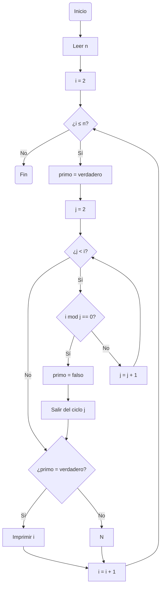

# RETO #3

Plantear el algoritmo para obtener los números primos hasta n, usando pseudocódigo y diagramas de flujo.

## Análisis
En este caso utilizaremos la forma de encontrar un número primo dividiendo n entre todos los números naturales que existan entre 2 y (n-1), si ninguno de ellos da 0 en el residuo de la división, el número será primo.


## PSEUDOCÓDIGO
A continuación, encotraremos un pseudocódigo con el ejercicio planteado.

```
[variables]
n : entero
i : entero
j : entero
Inicio
    Leer n
    Para i desde 2 hasta n hacer
        primo ← Verdadero
        Para j desde 2 hasta i-1 hacer
            Si i mod j = 0 entonces
                primo ← Falso
                Salir del para
            FinSi
        FinPara
        Si primo = Verdadero entonces
            Escribir i
        FinSi
    FinPara
Fin
```
## DIAGRAMA DE FLUJO
A continuación, encotraremos un diagrama con el ejercicio planteado.



### ¿Cómo se llegó a esto?
1. Necesitamos que se lea n, para saber hasta cuando parar de analizar los números.
2. Indicamos que hayan candidatos de números primos, esto va desde i=2 hasta i=n, con esto suponemos que i es primo para luego demostrar que no lo es.
3. Determinar un segundo ciclo de números (j) los cuales se le dividirán a i, desde 2 hasta (i-1) (excepto i y 1).
4. Dividir i entre j, si el residuo es 0, la variable será marcada como no primo (falso).
5. Si se revisán todos los candidatos, los que no cambiaron la variable falso, serán primos.
6. Se imprime i y se cierra el programa.

#### Eso es todo, gracias por la atención y chao.
